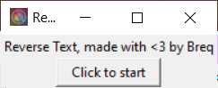

# Reverse Text Program

This program will force you to type everything in reverse. Yep, that's literally all it does.

{: .actual-size}

 

# Installation

### Windows
You can get an .exe [here]() which I made with PyInstaller. Note that *you may see an "Unknown Publisher" warning when you run this file*. This is because I'm not willing to pay [$200 a year](https://stackoverflow.com/questions/3580349/code-signing-microsoft-authenticode) for a code signing certificate. The program itself is perfectly safe.

### Build From Source
You can download the source code and install the dependencies yourself if you'd like instead. It's written in Python 3 and requires `Pillow`, `tkinter`, and `keyboard`. The Base64 blob isn't anything nefarious, it's just the icon for the app. The code is below:


import time
import tkinter as tk
import io
import base64
from PIL import Image, ImageTk

import keyboard

enabled = False

root = tk.Tk()
root.title("Reverse Text")

image_base64 = """
AAABAAEAEBAAAAEACABoBQAAFgAAACgAAAAQAAAAIAAAAAEACAAAAAAAAAAAAAAAAAAAAAAAAAAAAAAA
AABLJ2MASilfAEgmagBMKGQASyVxAEgpZwBHK2IARyZzAEoobABLLVwASSpoAEspbQBMLl0ASzBYAE8y
UwBJKHUASjJVAE80TwBQM1QASzNWADktbwBVN0oAQCx0AEUscwBKLHIAOi5wAD8ucAA0MG0AUCt3AEEt
dQBGLXQANTFuADoxbQA0M2kANTNqAFg8SAA/NGkANTZnAFg+RQAxN2gAQzN1ADE6ZgA2PGEAW0NCAFxE
QwBESEAATkdBAElHQwBeRUUAWUg9AC8/ZgBeR0AAVEhAAF9JOwBBSEgAWkk+AFZAXQA8R04AYEo8ACtC
ZQBlST8AW0o/AFxLQAA+SkwAZ0w7AGJMPgBjTT8AUziIAF9HVgAtR2QAO0tUAGpPPQBrUTgAPExVAGQ/
dQBLQXcAbFI5AGJKWQAwSmcAP0pkAHNUNwA0T1oAU0N5AGE9igBoVD4AczGsACxNZgAxTWUANVBbAGRB
fwBeT1QAOEttADdQYQAzUl8AM1FjAC5SZQA0VGEAL1NmAG1HfgBeVFoAMFRnADFUaABkWE8ALFVqAEpM
fwAyVWkAb0ClAC5ZZwAzWWcAL1htAFhaXgBYToUAYk6DAHw8twBTUIIAhDu9ADBcagB/QqwAc1J8ACxd
bQAsXHEAaVR7AIBDrQBdUosALl9vAFFaewBwXG4AK2JzAHFfawBRYmsAg2xBAHlSmQB7WYQAWGRsAHZY
iwBuaFsAdlqGAIlJuwBMZHwAfWJ5AHZalQCATrsAe1+MAE9rdwCDX5AAklG6AJdOxgCRTsgAcW1vAHtv
ZgBsX6AAmVDJAIFilgBdcHMAWWqIAF5ufQBkbnwAdHByAH5yaQBraooAXWeYAFlydgCGaYcAdGOiAFxr
jwBZa5cAiFrBAGlrkwBNcIwAmHVoAG11dQB9dHQAc3hvAG54cQBVcZEAWXd9AGV0hQCAeHIAonloAK+L
LQCMem4AgXh4AHptoACwjC4Ag3t1AKdezgBscaEAsIs8AJ6ISwCcYcwAqohLAHlxpQCTdZMAcXuKAKqH
VAB0dKMAp4xKAKaKUgCmYtQAc3yRAI97jQCMdqAAXoCOAJd3nABkgY4AkYCFAJV1qgBsf5gAnW3MAJSF
gwCtkFkArIxnAFiHkgBrgKYAt5ZPAEOFpgCvkWMAmImHAC+MnQB9i40AcIWsAK910QCpgawAZY+ZAIiO
lQCNkI4ASoyuAJWSjgCJgscAnZOTAEaXoAB9kqUAPJmrADWcqAAlnasAHZ+tAD+crgAnn60AxKloAIWb
rgBTpK8ASaqwAECtvABLwdEAV8/ZAAAAAAAAAAAAAAAAAAAAAAAAAAAAAAAAAAAAAAAAAAAAAAAAAAAA
AAAAAAAAfG1sYFFGNjYvLjQ0N1RAUHd0aVhRRoWsqoc0MT4+VEh0bWVcsODjr6+x46sxOkBHeF9e38yB
RpmdbmartUJBQFZeysGPm9Tps4KU4OWrMzxnVu+bwfDy6sTW0mPR5TMsVornm+j08eq3vO7FY82VJleb
z0/s8+bissS82DjItCZXqNV92uzkiY3exdhNwH4jMq7cKtemk9DdkpGpRKKAFSlbw6RDVXO9vcZ6YhPL
EREpKaClchpqepd6WXaLkBISJyVLunJ7n7ZTeYaEmAwJDSUlICijtnunUqLOhkoGCQkbHxkgGm+Wg8mM
CwoKBgEGGxQZFhYWFx4YDwcECwICAAAAAAAAAAAAAAAAAAAAAAAAAAAAAAAAAAAAAAAAAAAAAAAAAAAA
AAAAAAAAAAAAAAAAAAAAAAAAAAAAAAAAAAA=
""".replace("\n", "")

image_data = io.BytesIO(base64.b64decode(image_base64))

ico = Image.open(image_data)
photo = ImageTk.PhotoImage(ico)
root.wm_iconphoto(False, photo)

label = tk.Label(root, text="Reverse Text, made with <3 by Breq")
label.pack()

def toggle():
    global enabled
    if button.config('relief')[-1] == 'sunken':
        button.config(relief="raised", text="Click to start")
        enabled = False
    else:
        button.config(relief="sunken", text="Running...")
        enabled = True

button = tk.Button(root, text="Click to start", width=12, relief="raised", command=toggle)
button.pack()

def do_home(event):
    if event.name == "home" or keyboard.is_modifier(event.name):
        return
    if enabled:
        keyboard.release("left shift")
        keyboard.release("shift")
        keyboard.release("right shift")
        keyboard.send("home")

keyboard.on_press(do_home)

root.mainloop()

